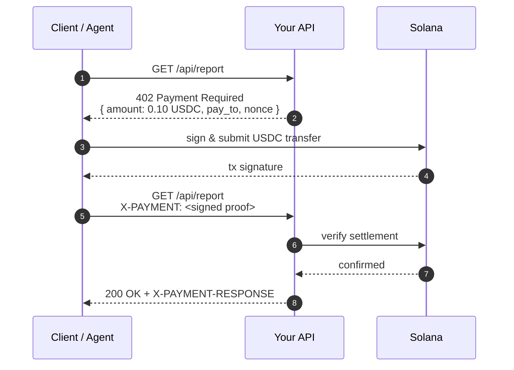

<div align="center">
  <picture>
    <source media="(prefers-color-scheme: dark)" srcset="https://github.com/solana-foundation/pay-kit/raw/main/docs/assets/banner-main-dark.png">
    <source media="(prefers-color-scheme: light)" srcset="https://github.com/solana-foundation/pay-kit/raw/main/docs/assets/banner-main-light.png">
    
  </picture>
</div>

<p align="center">
  <a href="https://skills.sh/solana-foundation/pay">
    
  </a>
  <a href="https://x402.org"></a>
  <a href="https://paymentauth.org"></a>
  <a href="LICENSE"></a>
</p>

<p align="center">
  <b>Add a stablecoin paywall to any HTTP route.</b><br/>
  In TypeScript, Rust, Go, Python, Ruby, PHP, Lua, Kotlin, or Swift.
</p>

---

## Why stablecoins?

Stablecoins are digital dollars (USDC, USDT, PYUSD, EURC, …) that move on public payment rails. For a developer building an API, a SaaS, or an agent that needs to pay for things, they unlock a few properties that classical card networks can't match:

- **No middleman.** Funds settle directly from payer to recipient. No gateway, no acquirer, no PSP holding the money for 2–30 days.
- **No 2.9% + 30¢.** Network fees are measured in fractions of a cent, not percentage points. Micro-transactions stop being a rounding error.
- **No chargebacks.** Payments are final once confirmed on-chain. Refunds happen because you choose to send one, not because a card network reversed it 90 days later.
- **No accounts to open.** Anyone with a wallet — a person, a script, an agent — can pay. No KYC dance before the first dollar moves.
- **Programmable.** Splits, fees, sponsored gas, subscriptions, refunds — all expressible as a transaction your server constructs.

## Why Solana?

Solana is the most-used blockchain for payments today, and it's the one this kit is built on.

- **~200ms settlement.** A buyer signs, your server sees the confirmation before the next render frame.
- **~$0.0013 median fee.** Stable, even when the network is busy. Predictable enough to charge $0.001 for an API call without losing money on the transfer.
- **~$2T in stablecoin transfers per quarter.** It's the rail Visa, PayPal, Stripe, and Western Union have all plugged into.
- **100% of the top 10 stablecoins.** USDC, USDT, PYUSD, EURC — pick the asset that matches your accounting.

See [payments.org](https://payments.org) for the long-form pitch.

## What this repo gives you

Two open protocols, sharing one mental model: an HTTP server replies `402 Payment Required` with a challenge, the client pays, and the same request is replayed with a proof of payment. The kit ships server and client SDKs for both.

- **[x402](https://x402.org)** — The minimalist take. Three-step handshake (request → 402 → pay → replay), single-recipient, the facilitator pays the network fee. Best for "one endpoint, one price, one wallet."
- **[MPP](https://paymentauth.org)** — The richer take. Same 402 handshake, but the challenge carries an intent that supports multi-recipient splits, server-side fee accounting, and a separate fee-payer signer. Best for marketplaces, platform fees, and gasless flows.



Live playground: [402.surfnet.dev](https://402.surfnet.dev).

## Quick start

A paid endpoint in seven lines of Ruby. Save as `config.ru`, `bundle exec rackup`, and you have a stablecoin paywall.

```ruby
# config.ru
require "sinatra/base"
require "solana_pay_kit"

class App < Sinatra::Base
  get("/report") do
    require_payment! usd("0.10")
    "premium content"
  end
end

run App
```

Call it from any HTTP client. Without payment you get a 402; with the [`pay`](https://github.com/solana-foundation/pay) CLI the wallet pops Touch ID, signs a USDC transfer, and replays the request:

```bash
brew install pay   # or: npm install -g @solana/pay

curl     -i http://127.0.0.1:4567/report   # → 402 Payment Required
pay curl -i http://127.0.0.1:4567/report   # → 200 OK + receipt
```

The same surface is available in nine languages — server-side, client-side, or both:

| Language   | Server | Client |
|------------|:------:|:------:|
| [TypeScript](typescript/) |   ✅   |   ✅   |
| [Rust](rust/)             |   ✅   |   ✅   |
| [Go](go/)                 |   ✅   |   ✅   |
| [Python](python/)         |   ✅   |   ✅   |
| [Ruby](ruby/)             |   ✅   |   —    |
| [PHP](php/)               |   ✅   |   —    |
| [Lua](lua/)               |   ✅   |   —    |
| [Kotlin](kotlin/)         |   —    |   ✅   |
| [Swift](swift/)           |   —    |   ✅   |

Each language directory has its own README with framework-specific snippets (Sinatra/Rails, Express, FastAPI, Axum, Gin, …).

## Playground

The [`playground/`](playground/) directory is a local web app that exercises every primitive in the kit end to end against the Solana Payment Sandbox (a hosted test validator — no real funds): single charges with multi-recipient splits, metered sessions that stream content against off-chain vouchers and settle the channel on-chain, subscriptions, and x402 endpoints. Generate a throwaway wallet in the browser, fund it from the built-in faucet, and watch each step of the 402 handshake — challenge, signing, broadcast, settlement — in the request timeline and event log, with a receipt link for every settled transaction.

```bash
cd playground
pnpm install
pnpm dev   # server on :3000, web app on :5173
```


## License

MIT
