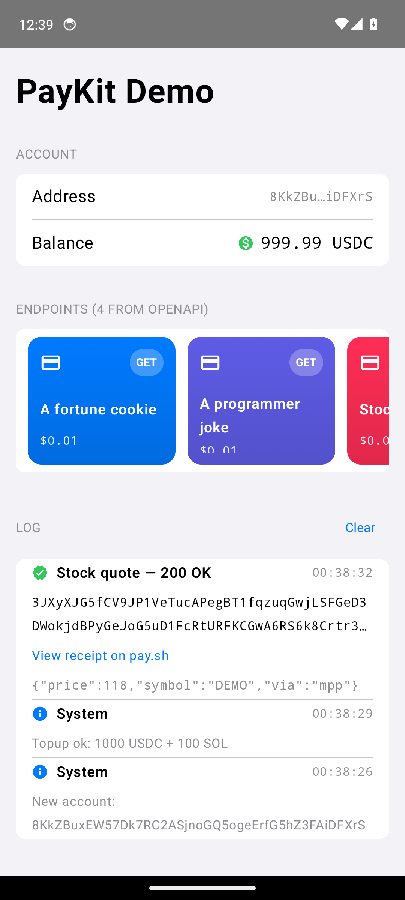

# MPP Charge Demo (Android)

A minimal Jetpack Compose Android app that pays a 402-protected route
using the Kotlin MPP SDK at `kotlin/` and signs the transaction with a
real Solana wallet via Mobile Wallet Adapter.

Tracked under issue #114.

## Layout

```
kotlin/examples/AndroidDemo
├── app/
│   ├── build.gradle.kts          AGP + Compose configuration
│   └── src/main/
│       ├── AndroidManifest.xml   single launcher activity
│       └── java/com/solana/mpp/demo/MainActivity.kt
├── build.gradle.kts              root project, declares plugins
├── settings.gradle.kts           single `:app` module
└── gradle/wrapper/               pinned Gradle 8.10.2
```

The Kotlin SDK lives at `../../src/main/kotlin` and is vendored into
the Android module via `sourceSets`. This avoids running the SDK's
pure JVM build alongside an Android library build and keeps the demo
buildable in isolation.

## Install Android SDK (from scratch)

On macOS:

```bash
brew install --cask android-commandlinetools
export ANDROID_HOME=/opt/homebrew/share/android-commandlinetools
export PATH="$ANDROID_HOME/cmdline-tools/latest/bin:$ANDROID_HOME/platform-tools:$PATH"
yes | sdkmanager --licenses
sdkmanager "platform-tools" "platforms;android-34" "build-tools;34.0.0"
```

A JDK 17 toolchain is also required. Microsoft and Temurin builds both
work:

```bash
brew install --cask temurin@17
export JAVA_HOME="$(/usr/libexec/java_home -v 17)"
```

## Build

```bash
cd kotlin/examples/AndroidDemo
./gradlew :app:assembleDebug
```

Output APK: `app/build/outputs/apk/debug/app-debug.apk`.

## Run on an emulator

```bash
sdkmanager "system-images;android-34;google_apis;arm64-v8a" "emulator"
yes | avdmanager create avd -n mpp-demo -k 'system-images;android-34;google_apis;arm64-v8a' -d pixel
"$ANDROID_HOME/emulator/emulator" -avd mpp-demo -no-snapshot &
adb wait-for-device
adb install -r app/build/outputs/apk/debug/app-debug.apk
adb shell am start -n com.solana.mpp.demo/.MainActivity
```

## Configure RPC + merchant URL

The single screen exposes two text fields:

- Merchant URL. Defaults to `https://402.surfnet.dev/protected`.
- Solana RPC URL. Defaults to `https://402.surfnet.dev/rpc`.

For a local surfpool + interop server on the host machine, point
both at `http://10.0.2.2:<port>` from inside the emulator (Android's
loopback alias for the host). The app permits cleartext HTTP only
for `10.0.2.2`, `127.0.0.1`, and `localhost` via
`app/src/main/res/xml/network_security_config.xml`. All other
destinations remain HTTPS-only.

## End-to-end screenshot

End-to-end run in the Android 34 (arm64) emulator against local
Surfpool + the iOSDemo's `MerchantServer/serve.py`. App shows
"HTTP 200", the fortune body, and the on-chain settlement signature.



## Expected UI state

1. On cold start the app shows "Idle. Press Connect Wallet to begin."
2. Tapping Connect Wallet hands off to Mobile Wallet Adapter, which
   deep-links into an installed wallet (Phantom, Solflare, Backpack, or
   a side-loaded mock wallet on the emulator). After the user approves
   the connection the app shows the wallet's base58 public key.
3. Tapping Pay issues an unauthenticated GET against the merchant URL,
   parses the 402 challenge, builds the unsigned charge transaction via
   `Charge.buildUnsignedChargeTransaction` with the wallet's pubkey as
   fee payer, hands the wire bytes to the wallet via
   `walletAdapter.transact { signTransactions(...) }`, base64-encodes
   the signed result, and replays the request with
   `Authorization: Payment ...`.
4. On success the UI shows the HTTP status, the response body, and a
   Solana Explorer URL for the on-chain settlement signature.
5. On failure the UI shows the exception class and message.

## Wallet setup

The demo requires a Mobile Wallet Adapter compatible wallet to be
installed on the device or emulator. Three options, ordered by
convenience:

- **Real wallet on a physical device.** Install Phantom, Solflare, or
  Backpack from Google Play, fund the account on devnet, and run the
  app on the same device. The wallet picker appears when you tap
  Connect Wallet.
- **Mock wallet on an emulator.** Build and install
  [`solana-mobile/mock-mwa-wallet`](https://github.com/solana-mobile/mock-mwa-wallet)
  on the same emulator. The mock wallet auto-approves requests with a
  hard-coded key and is the recommended path for CI or reviewer
  walkthroughs that do not need a real signature.
- **Seeker / Saga device.** Both ship with MWA preinstalled. Install
  the demo APK via `adb install` and tap Connect Wallet.

## SDK integration notes

The demo uses two SDK entry points instead of the high-level
`MppHttpClient`, because Mobile Wallet Adapter signs whole
transactions while `MppHttpClient` expects a `SolanaSigner` that
signs message bytes:

- `Charge.buildUnsignedChargeTransaction(walletPublicKey, request, blockhashProvider)`
  returns the raw legacy Solana transaction wire bytes with zeroed
  signature slots. The wire bytes are byte-identical to what the
  local-signer path produces before signing (asserted in
  `ChargeBuildTest.unsignedChargeTransactionMatchesSignedTransactionExceptForSignatureSlot`).
- `MppHeaders.formatAuthorization(PaymentCredential(challenge.echo(), CredentialPayload.transaction(base64SignedTx)))`
  builds the canonical `Authorization: Payment ...` header.

Any external-wallet integration (MWA, hardware wallet, HSM, etc.) can
follow the same two-step pattern.

## CI

`assembleDebug` runs on PRs that touch `kotlin/**` or this directory
via `.github/workflows/android-demo.yml`.
