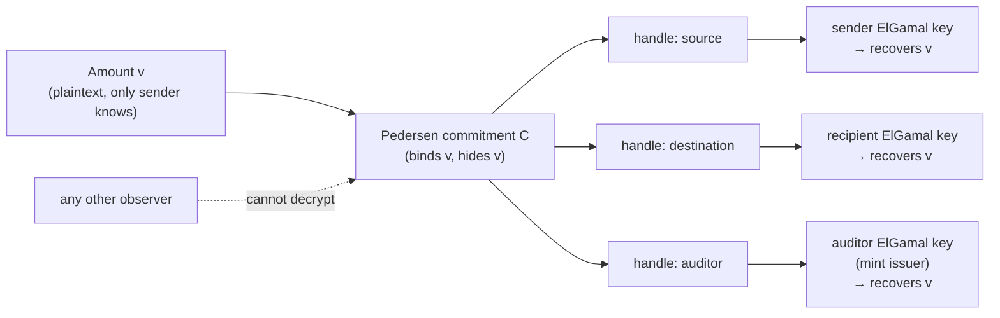
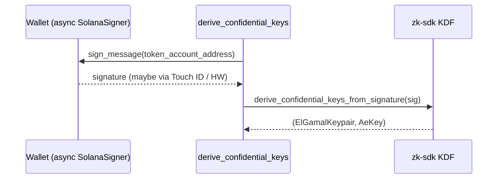
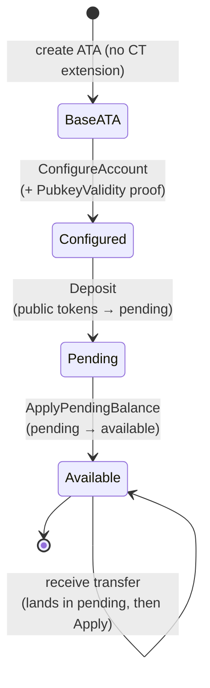
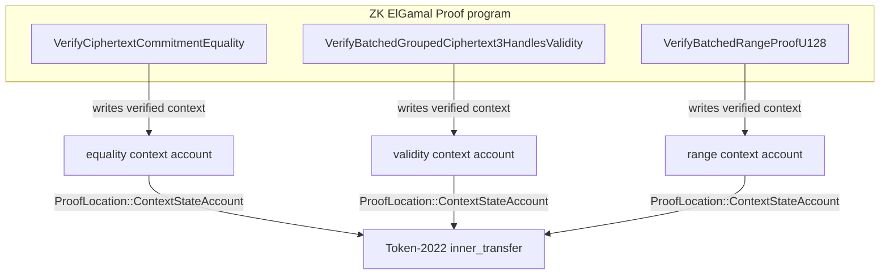
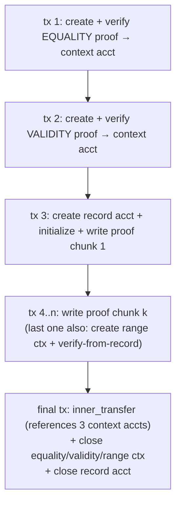
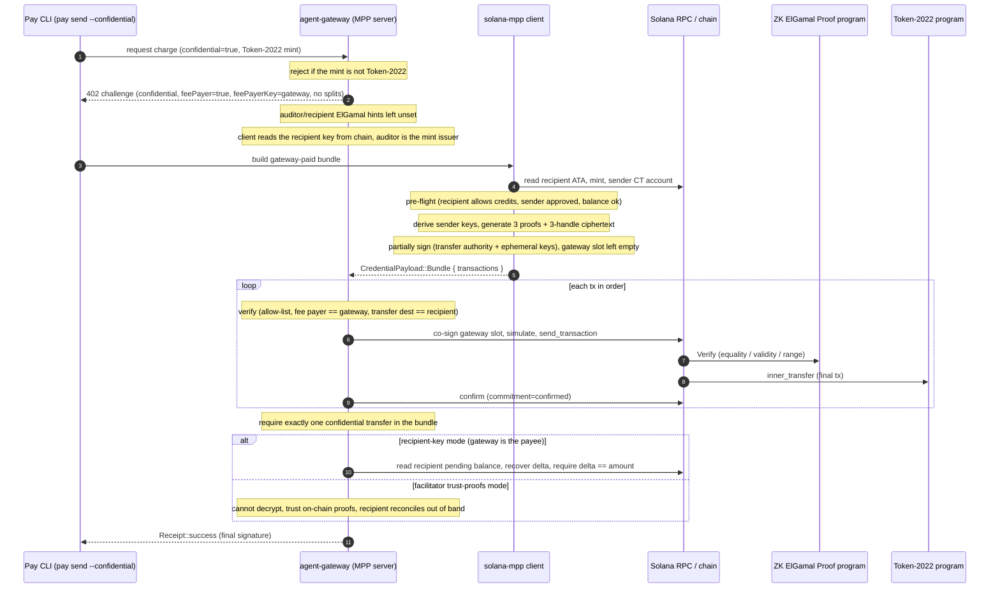
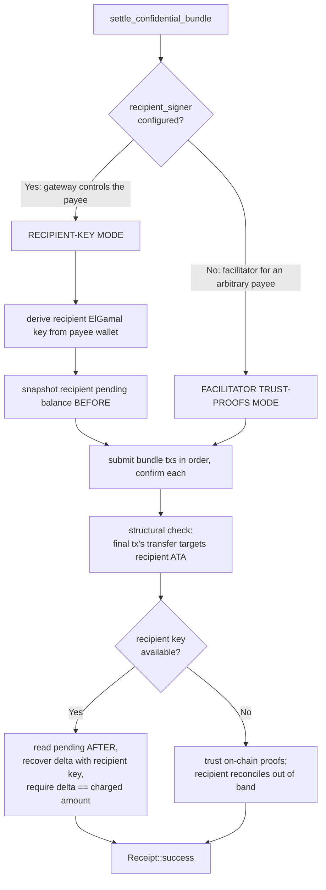

# Token-2022 Confidential Transfers

This document explains the confidential-transfer feature built into `solana-mpp`
(the MPP payment crate in `pay-kit`), and how it threads through the Pay CLI and
the agent-gateway. It is written for an engineer who knows Solana basics
(accounts, instructions, transactions, ATAs, rent) but has never touched
confidential transfers or zero-knowledge proofs.

By the end you should understand:

- the cryptography that makes a "hidden amount" transfer possible, at an
  intuition level;
- why a single confidential transfer becomes a *multi-transaction bundle*;
- how Pay issues, builds, and settles a confidential charge end-to-end;
- the two server-side settlement modes and the (important) design decision
  about who holds the auditor key;
- where every piece lives in the repos, and what dev shims are currently in
  place.

---

## 0. The 30-second mental model

A normal SPL token transfer puts the amount in plaintext in the transaction and
in the account state — anyone can read it. A **confidential transfer** encrypts
the amount so that only a few specific parties can read it, while the network
can still verify the transfer is *valid* (no negative balances, no minting out
of thin air) using zero-knowledge proofs.

The cost of that privacy: encryption + proofs are big and CPU-heavy, so what is
"one transfer" conceptually becomes a short *sequence* of transactions on the
wire. The bulk of this feature is the machinery that builds, stages, submits,
and verifies that sequence.

---

## 1. Crypto primitives (intuition, not math)

### 1.1 Twisted ElGamal encryption — and why it's *additively homomorphic*

Confidential balances are encrypted with **twisted ElGamal** over the Ristretto
group on Curve25519. You do not need the group theory; you need three facts.

1. **A ciphertext has two parts.** Encrypting a value `v` under a public key
   produces a pair `(C, D)`:
   - `C` is a **Pedersen commitment** to the amount — think of it as a sealed
     box that *binds* a specific number but reveals nothing about it. It is the
     same regardless of who the recipient is.
   - `D` is a **decryption handle** — a small piece of data, tied to one
     specific ElGamal public key, that lets the holder of the matching secret
     key open the commitment.

   The clean consequence: the heavy "what is the value" part (`C`) is shared,
   and you can attach *several handles* to the same commitment so that several
   different keys can each independently decrypt the *same* amount. We rely on
   this directly (see §1.4).

2. **It is additively homomorphic.** You can add two ciphertexts and get a
   ciphertext of the sum, without decrypting. This is what makes balances work:
   a confidential balance is literally the running ElGamal sum of every amount
   credited and debited. The Token-2022 program updates your encrypted balance
   by *adding* the encrypted transfer amount to it — it never sees a plaintext.

3. **Encryption is under an account's ElGamal public key.** Each confidential
   token account has its own ElGamal keypair. Amounts in that account are
   encrypted under its public key, which is recorded in the account's
   `ConfidentialTransferAccount` extension.

### 1.2 Why decryption needs a discrete-log solve → the 16-bit lo/hi split

Twisted ElGamal decryption does *not* hand you the number directly. It hands you
a group element of the form `value · G` (the value times a fixed base point).
Recovering `value` from `value · G` is the **discrete logarithm problem** — easy
only if `value` is small enough to brute-force.

Brute-forcing a full 64-bit amount is infeasible. The fix used everywhere in
confidential transfers (and in our code) is to **split the amount into two
16-bit halves**:

```
amount = lo + (hi << 16)
```

Each half is at most `2^16 - 1 = 65_535`, which is trivially solvable by a small
table/baby-step-giant-step lookup. So a transfer amount is carried as **two**
ElGamal ciphertexts — a `lo` ciphertext and a `hi` ciphertext — and the
recipient (or auditor) decrypts each half with a fast discrete-log solve, then
recombines.

This is exactly what `recover_split_amount` does in
[`src/protocol/confidential.rs`](../src/protocol/confidential.rs):

```rust
pub fn recover_split_amount(
    key: &ElGamalKeypair,
    ciphertext_lo: &[u8],
    ciphertext_hi: &[u8],
) -> Option<u64> {
    let lo_ct = ElGamalCiphertext::from_bytes(ciphertext_lo)?;
    let hi_ct = ElGamalCiphertext::from_bytes(ciphertext_hi)?;
    let lo = key.secret().decrypt_u32(&lo_ct)?;   // discrete-log solve, ≤ 16 bits
    let hi = key.secret().decrypt_u32(&hi_ct)?;   // discrete-log solve, ≤ 16 bits
    hi.checked_shl(16)?.checked_add(lo)            // amount = lo + (hi << 16)
}
```

`TRANSFER_AMOUNT_LO_BITS = 16` is the shift width. If you pass the wrong key, or
malformed bytes, you get `None` — there is no way to "partially" decrypt.

> A useful corollary for tests: any amount below `65_536` lives entirely in the
> `lo` ciphertext (`hi == 0`). The litesvm e2e test deliberately uses both a
> small amount and (in `auditor_recovers_transfer_amount`) amounts that straddle
> the boundary — `65_535`, `65_536`, `70_000`, `1_000_000` — to prove the split
> arithmetic is correct.

### 1.3 The AES "decryptable balance" — a fast path for the owner

There's an asymmetry: the account owner needs to read *its own* available
balance constantly (e.g. before spending), and doing a discrete-log solve every
time is wasteful. So Token-2022 stores a *second*, redundant copy of the
available balance encrypted with a **symmetric AES-GCM-SIV key** that the owner
also holds. This is the **decryptable available balance**.

- The ElGamal copy is what the *program* does homomorphic math on and what
  *proofs* are about.
- The AES copy is a convenience for the owner: decrypt it instantly, no
  discrete log, to learn "how much do I have right now."

The owner is responsible for keeping the two in sync. Whenever the available
balance changes (a transfer out, or `ApplyPendingBalance`), the owner computes
the new plaintext and supplies a fresh AES ciphertext of it. You can see this in
the bundle builder, which decrypts the current AES balance, subtracts the
transfer amount, and re-encrypts:

```rust
let current_plaintext = current_decryptable.decrypt(&sender_keys.ae)?;
let new_plaintext     = current_plaintext.checked_sub(params.amount)?; // no overdraft
let new_decryptable   = sender_keys.ae.encrypt(new_plaintext);
```

### 1.4 Three handles: source, recipient, auditor

Recall from §1.1 that one commitment can carry multiple decryption handles. A
confidential *transfer* amount is encrypted as a **grouped 3-handle ciphertext**:
the same commitment `C`, bound to three handles, so three parties can each
decrypt the *same* amount with *their own* key:

| Role | Who | Why they can decrypt |
| --- | --- | --- |
| **source** | the sender | needs it to update its own balance and prove correctness |
| **destination** | the recipient (payee) | the credited amount lands in *their* account, decryptable with their key |
| **auditor** *(optional)* | the mint issuer's compliance role | regulatory/compliance visibility, **only if the mint configures an auditor** |

The auditor handle is **optional**: it is included only when the mint's
`ConfidentialTransferMint` extension has an `auditor_elgamal_pubkey`. The builder
reads it from the mint and passes it (or `None`) to proof generation; a mint with
no auditor (like the test mint and our deploy) produces a source+destination
ciphertext with no auditor handle.



The grouping is *cryptographically bound*: a validity proof (§3) forces all
three handles to encrypt the *same* commitment, so a sender can't show the
auditor one amount and credit the recipient a different one.

> **Design correction, worth shouting:** the **auditor key belongs to the mint
> issuer**, not to the Pay gateway. An earlier design had the gateway acting as
> auditor; that's wrong. The gateway is the *recipient* of a payment and uses its
> *recipient* key (or, in facilitator mode, no decryption at all) — see §4.3.

### 1.5 Key derivation — keys come from the wallet, not from storage

A confidential account's ElGamal and AES keys are **deterministically derived
from the owner's wallet** by signing a public seed (the *token account address*).
This is the spl-token convention, so keys derived here interoperate with
accounts configured by the standard CLI and wallets. Because the keys come from a
signature, they never need to be stored — they can be re-derived on demand
whenever encryption or decryption is needed.

Our wrinkle: `SolanaSigner` is *async* (it may go through Touch ID, a hardware
wallet, or a KMS), whereas the zk-sdk's `derive_confidential_keys` expects a
synchronous `Signer`. So we sign the seed ourselves and feed the signature to
`derive_confidential_keys_from_signature` — the same modern KDF, just decoupled
from the sync trait. See `derive_confidential_keys` in
[`src/protocol/confidential.rs`](../src/protocol/confidential.rs):



The unit tests pin the important properties: derivation is **deterministic**
(same wallet + same account ⇒ same keys), varies by **account address**, and
varies by **wallet**.

---

## 2. The confidential-account lifecycle

Tokens don't start out confidential. An account moves through distinct states,
and a received transfer doesn't immediately become spendable. Here's the full
lifecycle (mirrored by the litesvm e2e test and the reference impl in
`/tmp/cbe-ref`):



### 2.1 ConfigureAccount (with a PubkeyValidity proof)

To enable confidential transfers on an account you:

1. create the base ATA,
2. `reallocate` it to make room for the `ConfidentialTransferAccount`
   extension,
3. submit a **PubkeyValidity proof** — a small zero-knowledge proof that you
   actually know the secret key behind the ElGamal public key you're
   registering (so you can't register a key you don't control), and
4. call `ConfigureAccount`, which records your ElGamal pubkey and an initial
   AES-encrypted zero balance.

Even this small proof is verified into a **proof context-state account**
(see §3.2) — the same pattern used for the bigger transfer proofs.

### 2.2 Deposit (public → pending)

`Deposit` moves ordinary, plaintext tokens already in the account into the
account's **pending** confidential balance. After deposit, the tokens are
encrypted, but they are not yet spendable confidentially.

### 2.3 ApplyPendingBalance (pending → available)

Why is there a "pending" balance at all? Because confidential credits arrive
asynchronously and the program must not let an incoming transfer mutate your
*available* balance mid-flight (that would invalidate proofs you might be
constructing about your available balance). So **every credit — deposits and
received transfers — lands in `pending`**, and the owner explicitly folds it
into `available` with `ApplyPendingBalance`:

- the owner decrypts the pending balance (with its ElGamal key),
- adds it to the current available balance,
- supplies a fresh **AES decryptable** copy of the new available total,
- and bumps the `pending_balance_credit_counter` so the program knows exactly
  which credits were applied.

After `ApplyPendingBalance`, the funds are confidentially spendable.

> This is why, in our settlement code, the gateway reads the recipient's
> **pending** balance (not available) to detect what just arrived: a received
> transfer credits pending, and the recipient hasn't run `ApplyPendingBalance`
> yet.

---

## 3. Anatomy of a confidential transfer

### 3.1 The three proofs

A confidential `Transfer` instruction must convince the program of three things
without revealing the amount. Each is its own zero-knowledge proof, generated by
`transfer_split_proof_data` (from
`spl-token-confidential-transfer-proof-generation`):

| Proof | What it guarantees |
| --- | --- |
| **CiphertextCommitmentEquality** | the new sender balance ciphertext commits to the same value the sender claims — ties the encrypted available balance to the amount being moved, so the sender can't lie about its remaining balance |
| **BatchedGroupedCiphertext3HandlesValidity** | the source/destination/auditor handles are all well-formed and all encrypt the *same* commitment (the binding from §1.4) |
| **BatchedRangeProofU128** | every relevant value is in a valid non-negative range — proves there's no overflow/underflow and no negative "balance," i.e. you aren't spending money you don't have |

### 3.2 Why they don't fit in one transaction → proof context-state accounts

These proofs are large, and a Solana transaction is capped at **1232 bytes** on
the wire. You cannot inline all three proofs plus the transfer into one tx.

The platform's answer is the **ZK ElGamal Proof program** (a native program at
`ZkE1Gama1Proof11111111111111111111111111111`) plus the **proof
context-state account** pattern:

1. Create a fresh account owned by the ZK program, sized for a specific proof's
   *context*.
2. Send a `Verify…` instruction that checks the proof and, on success, **writes
   the verified public context into that account** (`ContextStateInfo`).
3. Later, the Token-2022 `Transfer` instruction references those context
   accounts via `ProofLocation::ContextStateAccount(...)` instead of carrying
   the proofs inline. The program trusts them because the ZK program already
   verified them.
4. After the transfer, the context accounts are closed to reclaim rent
   (`close_context_state`).



### 3.3 The range proof is too big even to *submit* inline → spl-record staging

There's a second size problem. The `BatchedRangeProofU128` proof *data itself*
exceeds 1232 bytes, so you can't even fit the `Verify` instruction's payload in
one transaction. The workaround is to **stage the proof bytes into a temporary
`spl-record` account** first, in chunks, and then verify *from that account*:

- `encode_verify_proof_from_account(ctx, record_account, offset)` reads the
  proof from the record account instead of from instruction data
  (`RECORD_PROOF_OFFSET = 33` = 1-byte version + 32-byte authority prefix).
- The bundle builder writes the proof in chunks: a first ~750-byte chunk
  (sharing its tx with create + initialize), then ~900-byte write-only txs.
- The equality and validity proofs *are* small enough to verify inline (each in
  its own tx), so only the range proof needs the record dance.

> Note: in litesvm the 1232-byte packet limit is **not** enforced, so the e2e
> test verifies *all three* proofs inline (no spl-record). The spl-record
> staging is a *wire/cluster* concern, exercised by the real bundle builder, not
> by the in-process test.

### 3.4 The result: a multi-transaction *bundle*

Putting it together, one confidential transfer becomes an **ordered list of
signed transactions** — a `CredentialPayload::Bundle`:



The bundle builder (`build_confidential_transfer_bundle` in
[`src/client/confidential.rs`](../src/client/confidential.rs)) produces exactly
this. Because **clients hold no SOL**, the bundle is **gateway-paid**: the gateway
(the `feePayerKey` from the challenge) is the fee payer, rent funder, and
proof/record-account authority + rent-reclaim destination on every transaction.
The client only **partially signs** — the transfer authority and the ephemeral
proof/record account keypairs it generates — and leaves each tx's fee-payer
signature slot empty. The base64 bundle is handed to the gateway, which
**hard-verifies and then co-signs** each tx's empty fee-payer slot before
submitting in order (see §4.4). Net rent is ~0 (the accounts are created and
closed back to the gateway within the bundle); the gateway absorbs the small SOL
fee.

> A wrinkle visible in the code: proof *generation* uses zk-sdk `7.0.1`, but the
> spl-token-2022 instruction ABI is built against zk-sdk `4.0`. The fixed-size
> POD types are byte-identical between versions, so the builder does a set of
> `cast_*` zero-copy byte-casts at the instruction boundary. This is a
> version-skew artifact, not part of the protocol.

---

## 4. Our architecture: end-to-end `pay push --confidential`

### 4.1 The pieces

- **Pay CLI** (`/Users/ludo/Coding/pay`) — the `--confidential` flag on
  `pay send` (see [`commands/send.rs`](../../../../../pay/rust/crates/cli/src/commands/send.rs)).
  It just forwards `confidential: bool` into `send_stablecoin`.
- **agent-gateway** (`/Users/ludo/Coding/agent-gateway`) — issues the MPP
  charge **challenge** and later **settles** the bundle.
- **solana-mpp** (this crate) — the shared protocol + client bundle builder +
  server settlement logic.

### 4.2 The flow



### 4.3 The challenge: what the gateway sets (and what it deliberately doesn't)

When `confidential` is requested, the gateway:

- **rejects non-Token-2022 mints up front** — confidential transfers are a
  Token-2022 extension, so a plain SPL mint can't be used;
- sets `methodDetails.confidential = Some(true)`;
- leaves **`auditorElgamalPubkey` and `recipientElgamalPubkey` unset**. Per the
  gateway's own comment, the auditor is the *mint issuer's* compliance facility
  (not the gateway), and the client fetches the recipient's ElGamal pubkey from
  on-chain state itself. They exist in `MethodDetails` only as optional *hints*.

`validate_confidential_charge` in
[`src/protocol/solana.rs`](../src/protocol/solana.rs) is the spec's single source
of truth for the *strict* profile constraints: SPL Token-2022 only, no splits,
and the auditor key is **optional** — it is the mint issuer's facility, not
required for a charge, so the only auditor check is that a *present* hint is not
empty. It's a no-op unless `confidential == Some(true)`.

### 4.4 The two server settlement modes

This is the heart of the server logic (`settle_confidential_bundle` in
[`src/server/charge.rs`](../src/server/charge.rs)). The gateway must answer "was
I actually paid the right amount?" — but it can only decrypt amounts it has a key
for. So there are two modes, selected by whether the server is configured with a
`recipient_signer`:



**Recipient-key mode** (`recipient_signer` is `Some`): the gateway *is* the payee.
It derives the recipient ElGamal key from the payee wallet, reads the recipient's
confidential **pending** balance before and after the bundle, and decrypts the
delta with `recover_split_amount`. It then **enforces** that the delta equals the
charged amount — a hard cryptographic check that the right amount actually
arrived.

**Facilitator trust-proofs mode** (`recipient_signer` is `None`): the gateway is
settling on behalf of some *other* recipient and therefore cannot decrypt that
recipient's amount. It does the most it can:

- it submits the bundle and confirms every tx lands;
- it runs the **structural check** that the final transfer instruction's
  destination (the 3rd account of the Token-2022 transfer ix) is the expected
  recipient ATA, so the bundle can't silently pay someone else;
- it relies on the on-chain ZK program having verified the proofs (which
  guarantee the transfer is *valid* and the amounts on the three handles match);
- and the recipient reconciles the exact amount **out of band** with its own
  key.

In *both* modes the gateway never sees the auditor key — the auditor is the mint
issuer.

### 4.5 Safety details in settlement worth knowing

- **Simulate before broadcast.** Each bundle tx is simulated first; a failing
  simulation aborts before any fee is spent or a partial bundle lands.
- **Per-tx allow-list, then co-sign.** Before co-signing each tx's empty
  fee-payer slot, the gateway runs `verify_confidential_bundle_tx`: every
  instruction must be allow-listed (System `create_account` for ZK/record
  accounts funded by the gateway, ZK proof, spl-record, and ONLY the Token-2022
  confidential Transfer/TransferWithFee opcode), the fee payer must be the
  gateway, and the transfer destination must be the recipient ATA — all
  validated *before* anything is signed or broadcast (a wrong destination is
  irreversible once it lands). The bundle must carry **exactly one** confidential
  transfer. This matters because the gateway's fee-payer co-signature would
  otherwise authorise any Token-2022 op (transfer_checked/burn/close) naming the
  gateway as a signer — a token-drain vector the allow-list closes.
- **Orphan sweeper.** A partially-failed bundle can strand gateway-funded
  proof/record accounts; `Mpp::sweep_confidential_orphans` (worker feature) scans
  for gateway-owned ones and closes them back, with a two-pass guard so it never
  closes an in-flight settlement's accounts.
- **Confirm each tx before the next.** Later txs depend on earlier ones (the
  transfer references the context accounts), so the gateway waits for
  `confirmed` between txs.
- **Replay protection.** The final (transfer) signature is consumed via
  `consume_signature`, same as the other settlement arms.
- **Fail closed without the feature.** If the server is built *without* the
  `confidential` Cargo feature, a `Bundle` credential is rejected outright.

---

## 5. Verification & testing

The crate's confidence comes from an end-to-end [LiteSVM](https://github.com/LiteSVM/litesvm)
test suite in [`src/protocol/confidential.rs`](../src/protocol/confidential.rs)
that runs against the *real* programs (LiteSVM registers `spl_token_2022` and the
ZK ElGamal Proof program automatically).

1. **`zk_proof_program_accepts_generated_transfer_proofs`** — generates the three
   split-transfer proofs exactly as the bundle builder does and submits each to
   the ZK program for inline verification. The program accepts a proof *only* if
   it is both cryptographically valid **and** in the exact byte format this
   zk-sdk/agave version expects — so a green run proves our proof generation is
   correct *and* format-compatible.

2. **`recipient_recovers_confidential_transfer_amount_in_litesvm`** — the full
   lifecycle: create a confidential mint (auto-approve, **no auditor**) →
   configure sender + recipient accounts (with PubkeyValidity proofs verified
   into context accounts) → fund the sender (mint → deposit → apply-pending) →
   confidential transfer → and then the key assertion: **the recipient recovers
   the exact transferred amount from its own pending-balance ciphertexts using
   its own ElGamal key**, and a *wrong* key does not. This is the in-test analog
   of recipient-key settlement mode.

3. **`auditor_recovers_transfer_amount`** — proves the auditor (mint issuer's
   compliance role) can recover the exact amount from the auditor-handle
   ciphertexts, across amounts that straddle the 16-bit lo/hi boundary
   (`1, 100, 65_535, 65_536, 70_000, 1_000_000`), and that a wrong auditor key
   cannot.

4. Plus key-derivation unit tests (deterministic; varies by account; varies by
   wallet).

---

## 6. Repo layout & where things live

| Concern | Location |
| --- | --- |
| Crypto primitives, key derivation, `recover_split_amount`, litesvm e2e | `pay-kit/rust/crates/mpp/src/protocol/confidential.rs` |
| Protocol types: `MethodDetails`, `CredentialPayload::Bundle`, `validate_confidential_charge` | `pay-kit/rust/crates/mpp/src/protocol/solana.rs` |
| Client bundle builder (`build_confidential_transfer_bundle`, spl-record staging) | `pay-kit/rust/crates/mpp/src/client/confidential.rs` |
| Server settlement (`settle_confidential_bundle`, allow-list `verify_confidential_bundle_tx`, two modes) | `pay-kit/rust/crates/mpp/src/server/charge.rs` |
| Confidential worker run-loop + orphan sweeper (`worker` feature) | `pay-kit/rust/crates/mpp/src/server/confidential_worker.rs` + `sweep_confidential_orphans` in `charge.rs` |
| Surfpool e2e integration tests (full lifecycle, both settlement modes, sweep) | `pay-kit/rust/crates/mpp/tests/confidential_integration.rs` |
| `pay send --confidential` flag | `pay/rust/crates/cli/src/commands/send.rs` |
| Gateway challenge issuance (absorb fee, no splits) + worker wiring | `agent-gateway/.../endpoints/send.rs` + `state.rs` |

### 6.1 Dev shims currently in place

These are temporary and should be removed/updated as upstream catches up:

- **litesvm git patch.** Both `pay/rust/Cargo.toml` and `pay-kit/rust/Cargo.toml`
  contain a `[patch.crates-io]` override pointing `litesvm` / `litesvm-token` at
  upstream `master`:

  ```toml
  [patch.crates-io]
  litesvm       = { git = "https://github.com/LiteSVM/litesvm.git", branch = "master" }
  litesvm-token = { git = "https://github.com/LiteSVM/litesvm.git", branch = "master" }
  ```

  Upstream master loosens litesvm's pinned `solana-address` constraint (now
  `>=2.2, <3`) so it can coexist with the confidential-transfer proof crates
  (which pull a newer `solana-address`). The fix is merged but not yet in a
  crates.io release (`0.13.0` still pins `=2.2.0`), so the patch tracks `master`
  until a release carries it, then it can be dropped entirely. **Side effect:**
  the patch also redirects surfpool's litesvm, which destabilizes its embedded
  validator in CI — so the confidential end-to-end tests (and the surfnet
  integration tests in `tests/confidential_integration.rs`) live behind the
  opt-in `confidential` Cargo feature, which CI does not enable; they run
  locally with `cargo test -p solana-mpp --features confidential` where surfnet
  is stable.

- **`five8_core` std.** `pay/rust/crates/core/Cargo.toml` and
  `pay-kit/rust/crates/mpp/Cargo.toml` each force `five8_core` with
  `features = ["std"]` so its `impl Error for DecodeError` stays enabled through
  dependency re-resolution (solana-keypair 3.1 → five8 1.0.0 → five8_core 0.1.2,
  whose `Error` impl is `#[cfg(feature = "std")]`; feature unification otherwise
  drops it and the build fails with `DecodeError: std::error::Error is not
  satisfied`). Drop once five8_core ships the impl unconditionally.

- **pay-kit PR #181 branch dependency.** The `pay` repo tracks the
  confidential-transfer feature branch of `pay-kit` until it merges:

  ```toml
  # Tracks the confidential-transfer + solana-4.0 branch (pay-kit PR #181)
  solana-mpp = { git = "https://github.com/solana-foundation/pay-kit", branch = "feat/confidential-transfers", ... }
  ```

- **zk-sdk version skew.** As noted in §3.4, proof generation (zk-sdk 7.0.1) and
  the Token-2022 instruction ABI (zk-sdk 4.0) differ; the `cast_*` POD byte-casts
  in `client/confidential.rs` bridge the gap. This is a build-time artifact of the
  current dependency graph, not a protocol feature.

---

## Appendix: glossary

- **ElGamal keypair** — per-account asymmetric key; amounts in the account are
  encrypted under its public key. Derived from the wallet signature over the
  account address.
- **AES (decryptable) balance** — a symmetric-encrypted copy of the *available*
  balance for fast owner-side reads, no discrete log.
- **Pedersen commitment (`C`)** — the recipient-agnostic part of a ciphertext;
  binds a value while hiding it.
- **Decryption handle (`D`)** — the per-key part of a ciphertext; opens `C` for
  one specific ElGamal key.
- **Pending vs available balance** — credits land in *pending*; the owner folds
  them into *available* (spendable) with `ApplyPendingBalance`.
- **Proof context-state account** — an account owned by the ZK ElGamal Proof
  program holding a verified proof's public context, referenced by the transfer.
- **spl-record account** — scratch account used to stage the oversized U128 range
  proof so it can be verified from account data rather than instruction data.
- **Bundle** — the ordered list of signed transactions (`CredentialPayload::Bundle`)
  that together settle one confidential transfer.
