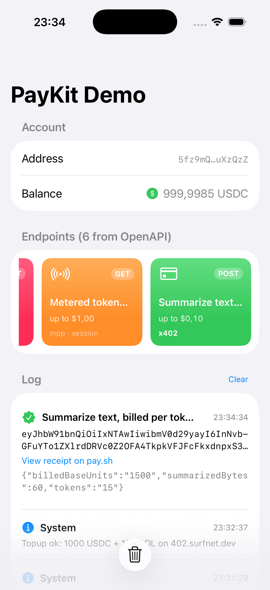

# PayKitDemo

SwiftUI app that exercises `SolanaPayKit` end-to-end against the
pay-kit playground. On launch it fetches the playground's
`/openapi.json`, renders every priced operation (read from each route's
`x-payment-info` offers) as a tappable collection, generates a
Keychain-backed account, tops it up over Surfpool cheatcodes, then lets
you consume any endpoint and surfaces each charge's settlement
signature in an append-only log.



## What you need

- The pay-kit playground running on `http://127.0.0.1:3000` (see
  [`typescript/examples/playground-api`](../../../typescript/examples/playground-api))
- Xcode 16+ and an iOS 17+ Simulator

The demo's signer is **stored in iOS Keychain** under
`dev.solana-mpp.paykitdemo`. It's a software key suitable for sandbox
testing only — for production swap `DemoSigner` for Solana Mobile
Wallet Adapter or the Seeker Seed Vault.

## Run it

### 1. Start the playground

In one terminal:

```sh
cd typescript/examples/playground-api
pnpm install
pnpm start
```

This boots the pay-kit playground on `http://127.0.0.1:3000`, serving
`/openapi.json` plus the priced routes and routing settlement through
the hosted Surfpool sandbox (`https://402.surfnet.dev:8899`). Leave it
running.

### 2. Launch the app

```sh
open swift/Examples/PayKitDemo/PayKitDemo.xcodeproj
```

Pick an iPhone simulator (iOS 17+), build, run. The Account section will
start empty.

### 3. Setup → Topup → Pay

Inside the app:

1. Tap **Setup Account** — generates a fresh Ed25519 keypair and saves
   it in Keychain. The Account section then shows a truncated
   `first6…last6` address.
2. Tap **Topup 1000 USDC + 100 SOL** — issues the
   `surfnet_setAccount` / `surfnet_setTokenAccount` cheatcodes against
   the hosted Surfpool RPC. The cell collapses into a `Balance`
   readout (e.g. `1000 USDC`) once funding lands.
3. Tap any card in **Endpoints (… from OpenAPI)** — the cards are built
   from the playground's `/openapi.json`, so they reflect whatever the
   running server prices (e.g. `Stock quote`, `A programmer joke`). The
   SDK handles the `402 → sign → 200` dance and appends the result to the
   **Log** section below.

The address persists across launches; **Reset Account** in the bottom
toolbar wipes it from Keychain.

## Manual end-to-end smoke test

Checklist for verifying the demo works end-to-end.

1. **Launch.** App opens to `PayKit Demo`. The Account section shows
   only the **Setup Account** button. Endpoint cards are disabled.
2. **Setup Account.** Tap it — the address shrinks to `first6…last6`,
   the **Topup** button appears, and a "New account: …" entry lands
   at the top of the Log (with the full base58 address).
3. **Topup.** Tap **Topup 1000 USDC + 100 SOL**. Within a second the
   Topup row is replaced by `Balance: 1000 USDC` and the Log shows
   `Topup ok: 1000 USDC + 100 SOL on 402.surfnet.dev`.
4. **Pay cheapest endpoint.** Tap the blue **Usage Report** card
   ($0.01). The card spinner runs briefly. A success row lands in the
   Log: green checkmark, `Usage Report — 200 OK`, the base58
   signature, and a `View receipt on pay.sh` link. The balance drops
   by $0.01.
5. **Receipt link.** Tap it; Safari opens to
   `https://pay.sh/receipts/<signature>`.
6. **Pay another endpoint.** Try **Compute Job** ($0.10) or
   **Subscription** ($49.99). A second success row appears with a
   different signature — charges are non-replayable.
7. **Failure mode.** Tap **Disbursement** ($1000) when the balance is
   below $1000; the Log shows a red failure row with the verifier's
   error.

If a step fails, see [Troubleshooting](#troubleshooting).

## Troubleshooting

### `Could not connect to the server` (NSURLErrorDomain -1004)

The gateway is not running, or it is not on `127.0.0.1:1402`. Run `lsof
-i :1402` — if empty, `pay server demo` is not up. If something else
owns the port, `kill` it, or change `gatewayURL` at the top of
`PayKitDemo/ContentView.swift` and rebuild.

### `verification_failed` after a successful topup

The gateway runs three concurrent MPP verifiers (USDC, USDT, CASH) and
only returns the *last* error — so a credential-currency mismatch
error often masks the real cause. Re-tap **Topup** and retry; if it
still fails, restart `pay server demo` to refresh its
challenge-binding secret.

### Topup logs `RPC error: …`

The configured RPC is not a Surfpool. The surfnet cheatcodes only work
against `https://402.surfnet.dev:8899` (default) or a local Surfpool.
Mainnet/devnet RPCs do not implement them.

### Want to run fully offline?

Swap the hosted sandbox for a local Surfpool:

```sh
# In one terminal
surfpool start

# In another
pay server demo --local
```

Then change `rpcURL` in `PayKitDemo/ContentView.swift` to
`http://127.0.0.1:8899` and re-run Setup + Topup.

## Layout

```text
PayKitDemo/
├── PayKitDemo/                # SwiftUI app
│   ├── PayKitDemoApp.swift    # @main entry
│   ├── ContentView.swift      # Account section + endpoint carousel + log
│   ├── DemoSigner.swift       # Keychain-backed account + surfnet topup
│   └── Info.plist             # NSAllowsLocalNetworking for 127.0.0.1:1402
├── PayKitDemo.xcodeproj/
└── docs/                      # Screenshot used by this README
```
